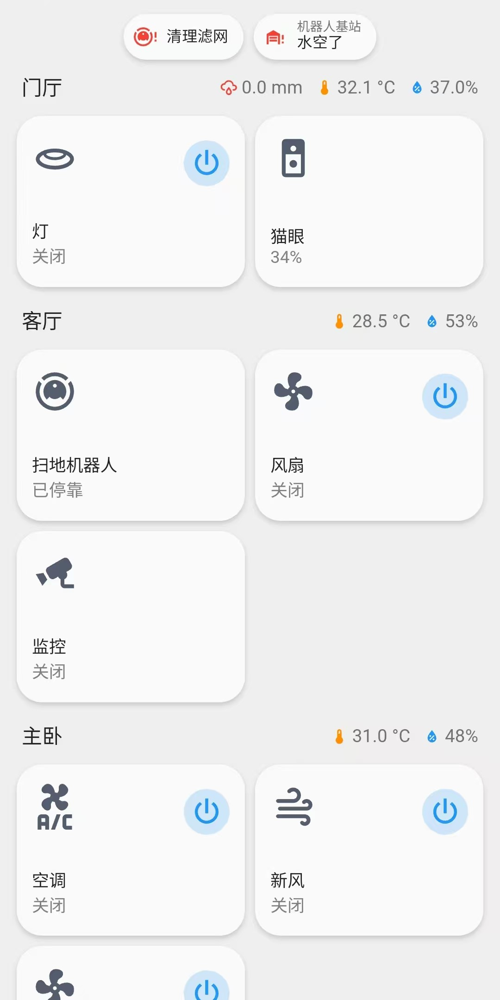
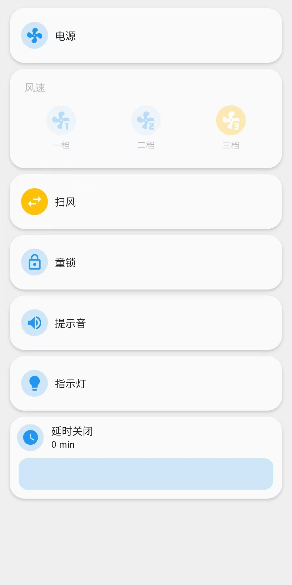
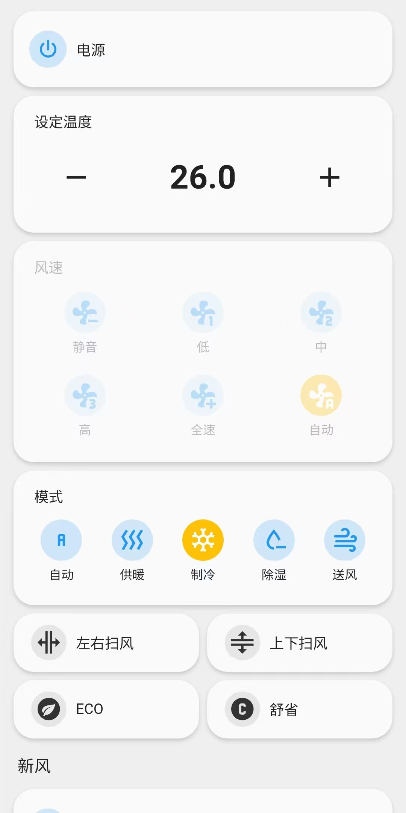
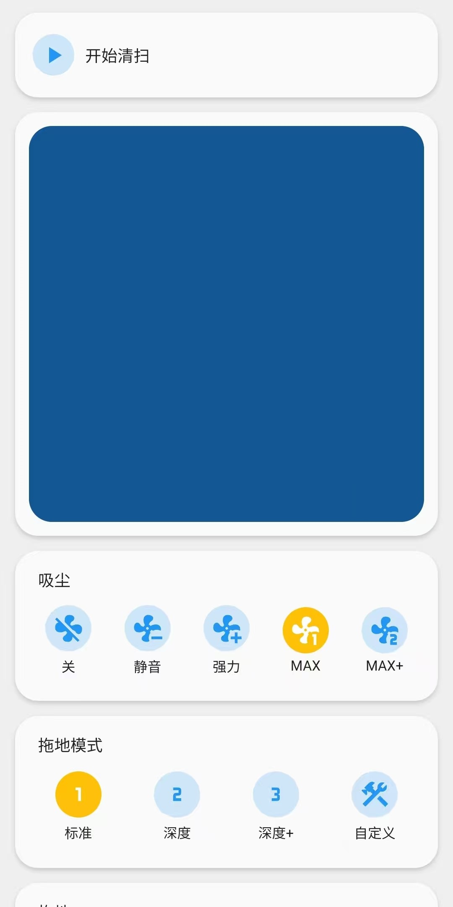

# hass-home

我的 `HomeAssistant` 面板的 `YAML` 配置，基于
[Button card](https://github.com/custom-cards/button-card)。

这个配置将所有的设备放在主页中，并通过右上角的开关按钮快速操作设备，
将更多的操作放在点击卡片后打开的设备详情页面中。

几乎所有的控件都是由 `Button card` 实现，除了滑块，实在是不好弄，
所以使用了 `mushroom` 的数字滑块。同时为了风格统一，
把所有的按钮都调整成了和 `mushroom` 一样的配色。

> [!IMPORTANT]
> **这不是一个模板，组件也不是通用组件，不能直接套用** 

## Screenshot

  

    
主页

    
  

  

    
风扇

    
  

  

    
空调

    
  

  

    
扫地机器人 *蓝色区域是地图

    
  

## Requirements
- [Button card](https://github.com/custom-cards/button-card)
- [mushroom](https://github.com/piitaya/lovelace-mushroom)
